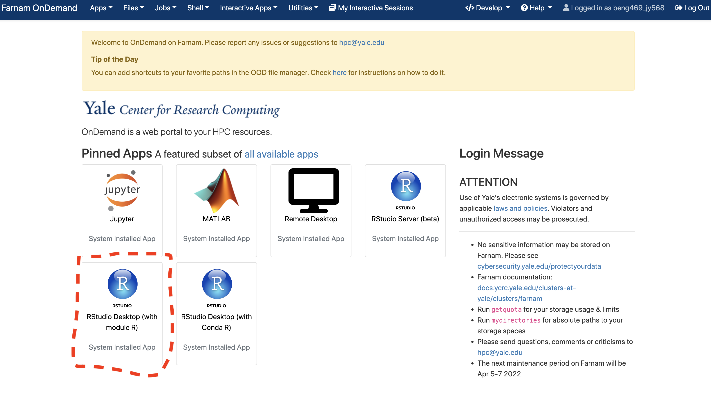

## Trajectory analysis using Monocle 2 and Monocle 3

---
#### Environment Setup:

1. Open Farnam OnDemand:
   
   Go to ```beng469.ycrc.yale.edu``` in your web browser (make sure that you are on Yale Network or Yale VPN). You will see the following window once you logged in.
   
   
   
2. Click open **RStudio Destop (with Module R)**

   
