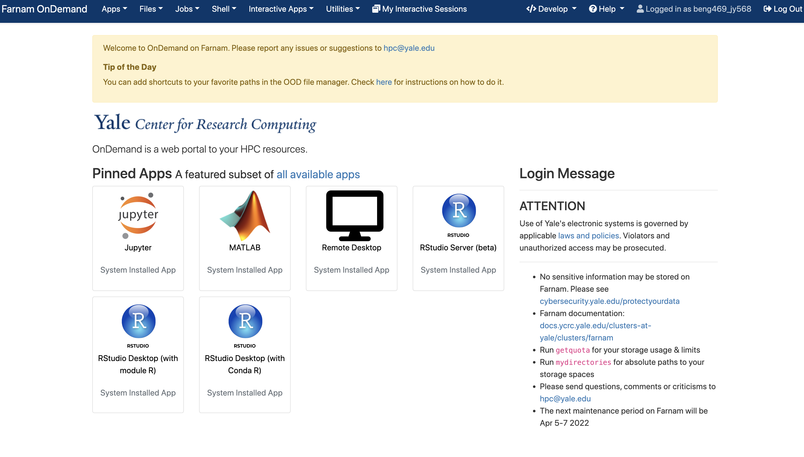
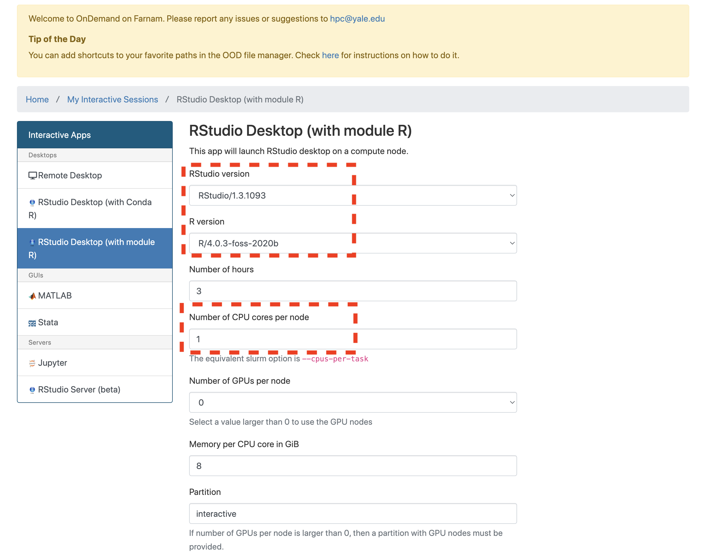
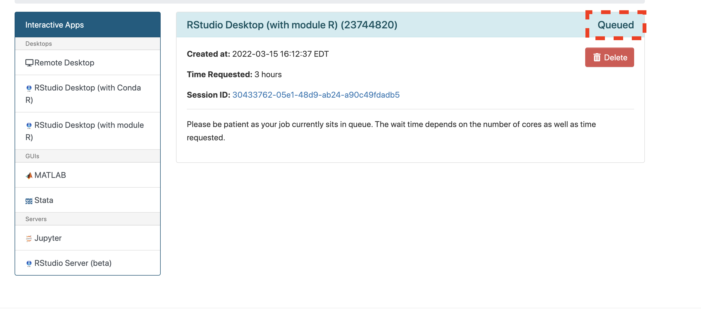
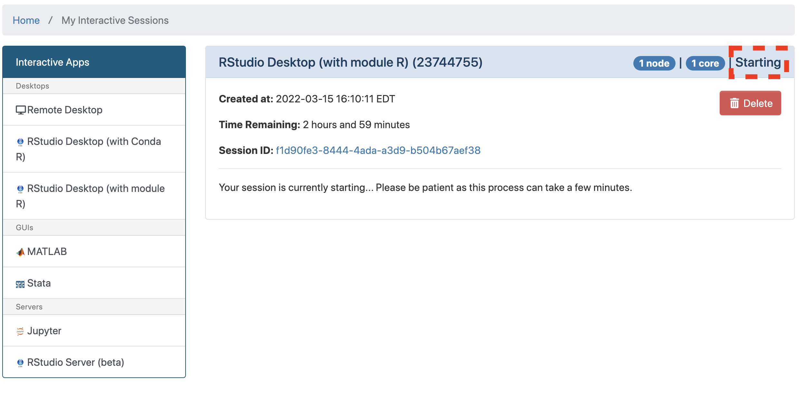

## Trajectory analysis using Monocle 2 and Monocle 3

---
#### Environment Setup:

1. Open Farnam OnDemand:
   
   Go to ```beng469.ycrc.yale.edu``` in your web browser (make sure that you are on Yale Network or Yale VPN). You will see the following window once you logged in.
   
   
   
2. Click open **RStudio Destop (with Module R)**

   
   
3. Request computation resources
   
   Specify the resources as shown below (you can leave other optional boxes blank), then click **Launch**
   
   
   
   

4. Lauch Rstudio Desktop
   
   Wait for a few seconds until you see your requested session is running, then click **Launch RStudio Desktop (with Module R)**
   
   
   
   
   
   
