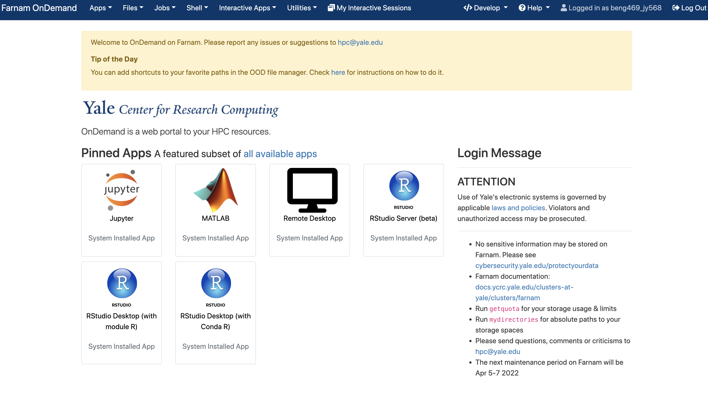
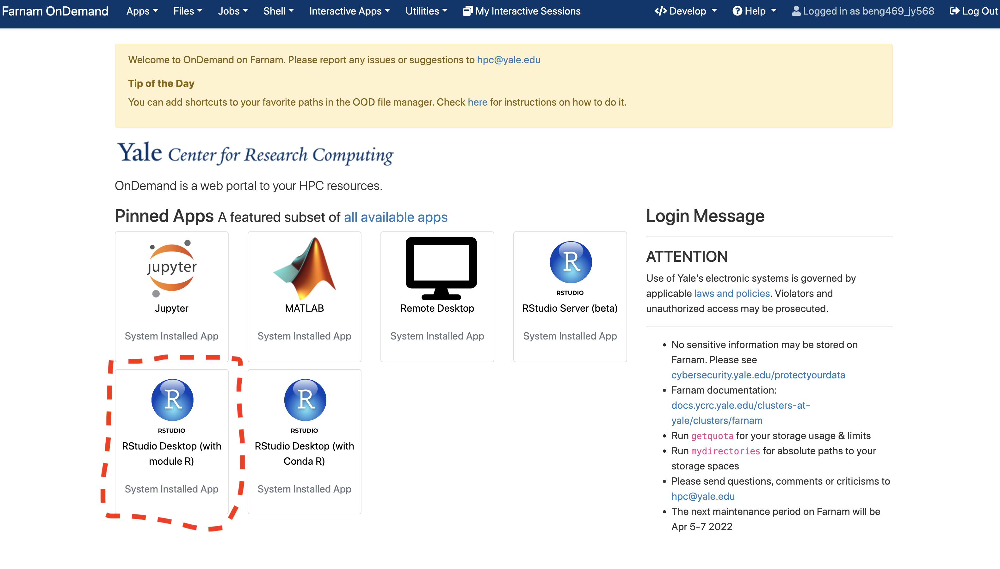
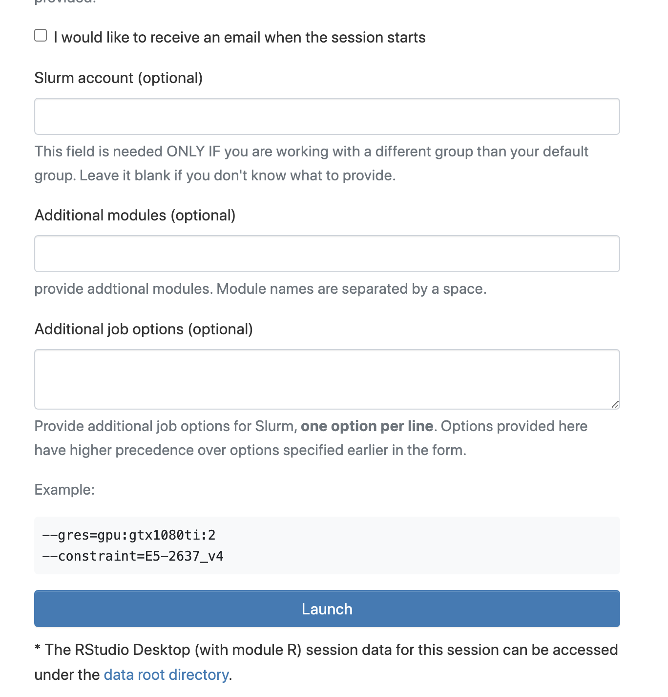
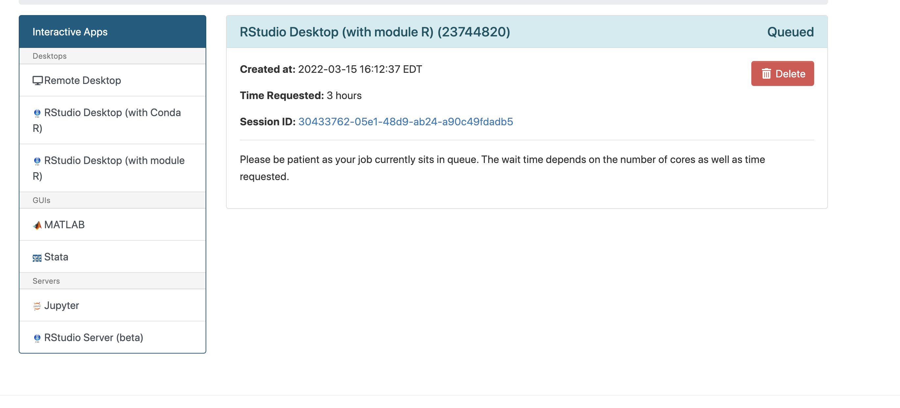
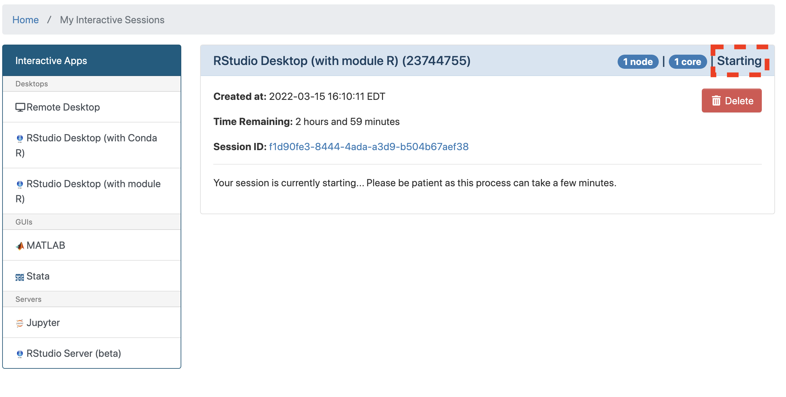
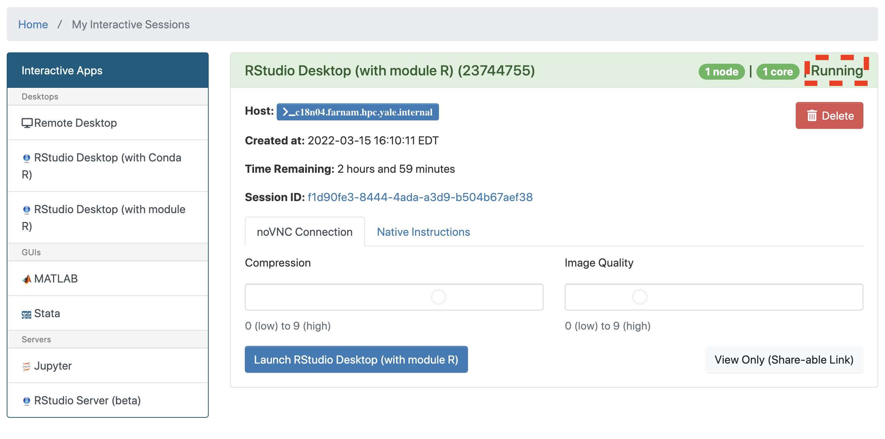
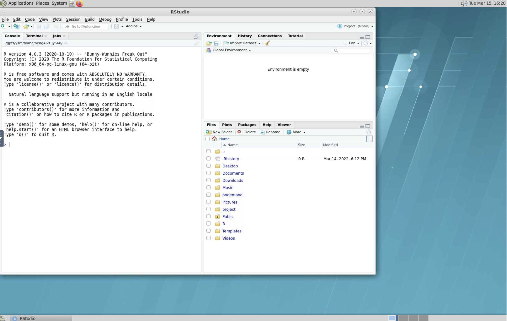
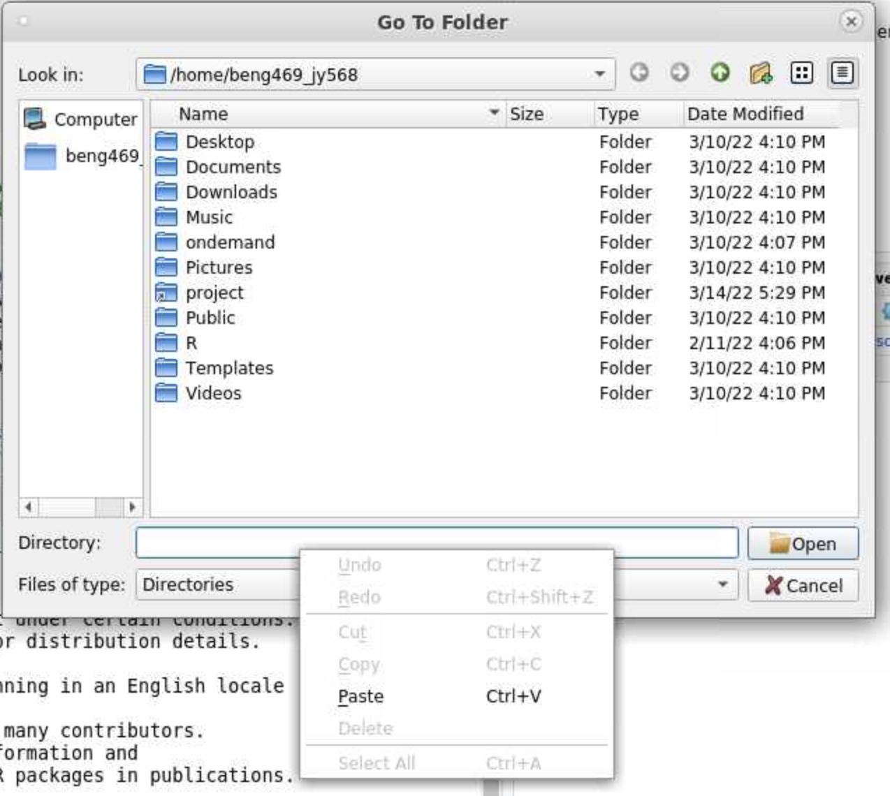
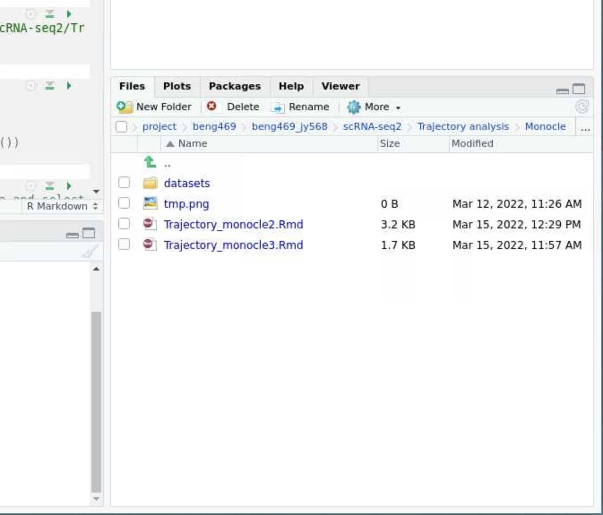

## Part1: Trajectory analysis using Monocle 2 and Monocle 3

#### Environment Setup:

1. Open Farnam OnDemand:
   
   Go to ```beng469.ycrc.yale.edu```[beng469.ycrc.yale.edu] in your web browser (make sure that you are on Yale Network or Yale VPN). You will see the following window once you logged in.
   
   
   
2. Click open **RStudio Destop (with Module R)**

   
   
3. Request computation resources
   
   Specify the resources as shown below (you can leave other optional boxes blank), then click **Launch**
   
   
   
   

4. Lauch Rstudio Desktop
   
   Wait for a few seconds until you see your requested session is running, then click **Launch RStudio Desktop (with Module R)**. Ideally you will see a new window poping out, that's the virtual machine interface with Rstudio launching inside.
   
   
   
   
   
   

   
   
5. Open the Monocle 2 and Monocle 3 RMD files inside Rstudio

   Inside Rstudio, click the ellipsis icon in the file navigating panel at the bottom right. In the "Go To Folder" window that pops out, paste the following path to the "Directory" box: ```/gpfs/ysm/project/beng469/beng469_jy568/scRNA-seq2/Trajectory analysis/Monocle/```, then click "Open". This will lead you
to the directory where  *Trajectory_monocle2.Rmd* and  *Trajectory_monocle3.Rmd*  are located. You can click these files to open them.

   

   
   
   


---
## Part2: PHATE visualization

#### Environment setup

Here we will run the analysis in a python jupyter notebook using google colab, click the badge below to launch the notebook:

[](https://colab.research.google.com/github/jcyang34/BENG469_2022spring/blob/main/scRNA-seq-analysis-lab2/PHATE/PHATE.ipynb)
